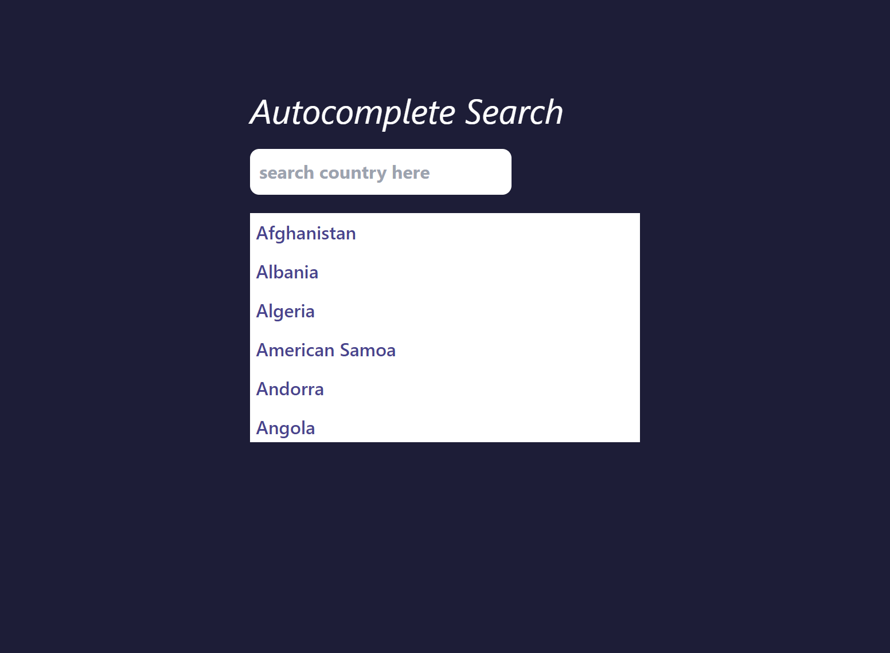
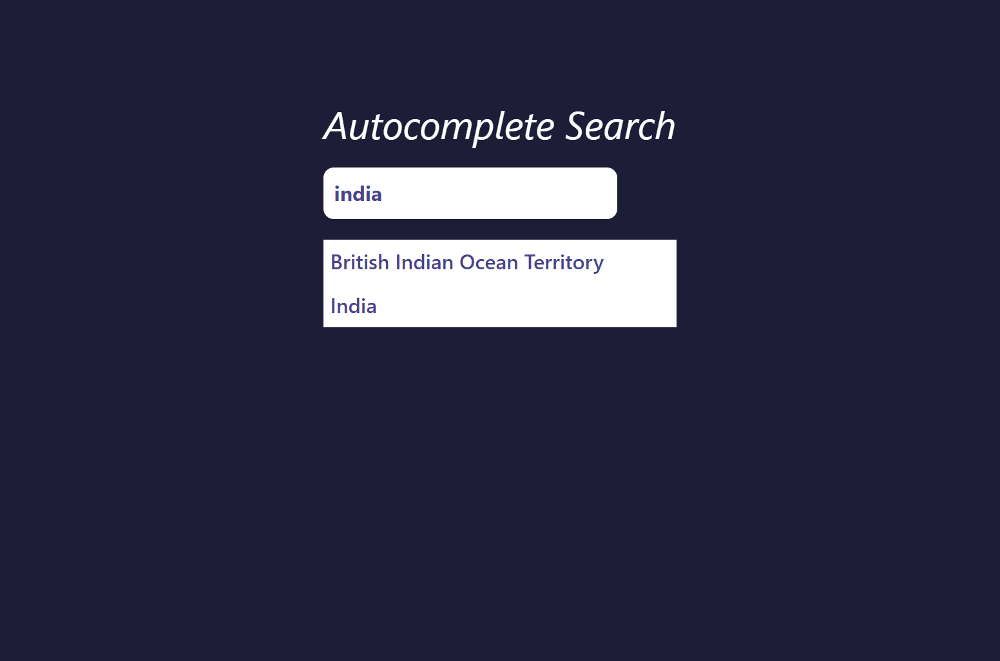

# JS ASSIGNMENT

Autocomplete search

### default:

### output:

It took me around 3 hours to complete it.

Technology Used:

- HTML
- CSS
- JAVASCRIPT

Live Demo: [Link](https://js-autocomplete-search.netlify.app/)
